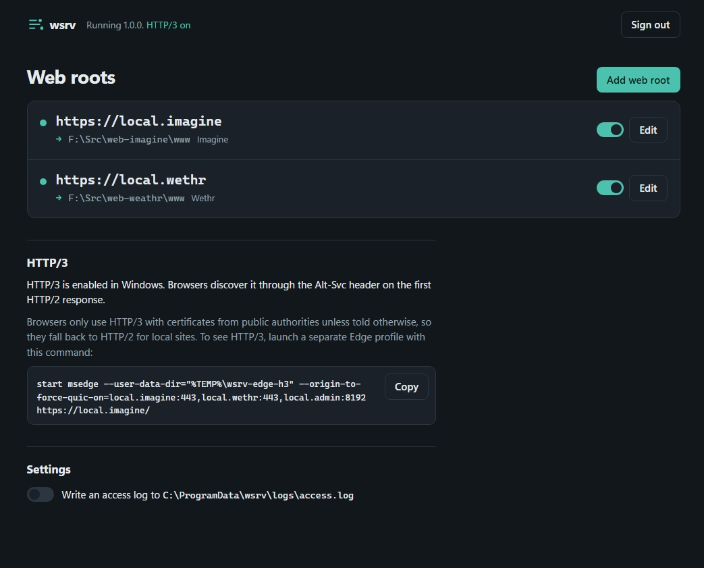

# wsrv

A super-lightweight HTTPS / HTTP/3 static web server for Windows 11 x64.

- Map any number of local folders to addresses like `https://local.blog` or `https://local.docs:8443`.
- HTTPS only, with locally trusted certificates created automatically.
- HTTP/3 (QUIC), HTTP/2 and HTTP/1.1 through Windows' built-in `http.sys`.
- `GET` and `HEAD` only. No CGI, no server-side code: content sites are read-only.
- Visitors can't reach anything outside a site's folder.
- Manage everything at **https://local.admin:8192**.
- One 1.5 MB `wsrv.exe`. Runtime dependencies are Windows system DLLs only
  (`httpapi`, `crypt32`, `ncrypt`, `advapi32`, `shell32`, `ole32`, `user32`, `kernel32`).



See [PLAN.md](PLAN.md) for the design and the reasoning behind it.

## Install

Download `wsrv.exe` from the [latest release](https://github.com/andrewrigney1975-cpu/ar-lightweightwebserver/releases/latest)
(or [build it](#build)), then from an **elevated** prompt in that folder:

```
.\wsrv.exe install
```

This copies `wsrv.exe` to `C:\Program Files\wsrv`, creates the private configuration database in
`C:\ProgramData\wsrv` (SYSTEM and Administrators only), enables HTTP/3 in http.sys, installs and
starts the `wsrv` Windows service (automatic start, restarts on failure) and adds a **wsrv Admin**
Start-menu shortcut.

If HTTP/3 was not already enabled in http.sys, reboot once; until then sites are served over HTTP/2.

To upgrade, run `wsrv install` again from the new build: it stops the service, replaces the
executable and starts it again. Sites, certificates and settings are kept.

## Use

Open **wsrv Admin** from the Start menu (or run `wsrv open-admin`). It signs you in to
https://local.admin:8192 with a single-use link. Only the user who ran `wsrv install` and
Administrators can obtain sign-in links.

In the admin site, **Add web root**: choose an address (`local.` + a name), a port and a folder.
wsrv then, without a restart:

1. creates a certificate for the address and trusts it on this machine,
2. binds it in http.sys for that address and port,
3. adds the address to the hosts file (pointing at `127.0.0.1` and `::1`),
4. starts serving the folder.

Leave the folder empty to serve a black "Hello, world!" page. When no folders are mapped at all,
`https://localhost/` shows that page too.

### Commands

| Command | |
|---|---|
| `wsrv install` | Install and start the service (elevated). |
| `wsrv uninstall [--purge]` | Remove the service, certificates, TLS bindings, hosts entries and shortcut. `--purge` also deletes the database and logs. |
| `wsrv open-admin` | Sign in to the admin site in your browser. |
| `wsrv run [--data DIR] [--open]` | Run in the foreground for development (elevated; stop the service first). |
| `wsrv status` | Service and HTTP/3 status. |

### HTTP/3 status

http.sys reads its HTTP/3 switch only when Windows starts, so wsrv reports three states (in
`wsrv status`, the service log and the admin site header):

| State | Meaning |
|---|---|
| **HTTP/3 on** | The switch is on and Windows has restarted since it was set. |
| **HTTP/3 after reboot** | The switch is on but was set after Windows started. Reboot to activate it. |
| **HTTP/3 off** | The switch is off. `wsrv install` turns it on. |

wsrv tells these apart by comparing when http.sys's settings were last changed with when Windows
started. Changing any other http.sys setting since boot also reads as "after reboot", and so does
restarting the HTTP service instead of rebooting.

## Seeing HTTP/3 in a browser

Browsers learn about HTTP/3 from the `Alt-Svc` header on an HTTP/2 response. Chromium-based
browsers (Edge, Chrome) refuse QUIC with certificates that don't chain to a public root unless
the origin is forced, so local sites normally stay on HTTP/2. The admin site shows a ready-made
command that opens a separate Edge profile with
`--origin-to-force-quic-on=<your sites>`. Check the **Protocol** column (`h3`) in DevTools → Network.

## Static file behaviour

- `index.html` / `index.htm` for folders; folders without a trailing `/` redirect.
- `ETag`, `Last-Modified`, `304 Not Modified`, single byte ranges (`206`/`416`), `If-Range`.
- Pre-compressed siblings: `app.js.br` / `app.js.gz` are served for `app.js` when the browser accepts them.
- Optional directory listing and per-site `Cache-Control` (default `no-cache`).
- Hidden/system files and dot-files are not served unless enabled per site.
- Any other method gets `405 Method Not Allowed` with `Allow: GET, HEAD`.
- Requests from other machines are refused: wsrv is for local access only.

## Security model

- **Containment.** Each request path is checked segment by segment (no `..`, `\`, `:`, device
  names, trailing dots or spaces, control characters). The file is then opened and its *final*
  on-disk path, after junctions, symlinks and 8.3 names are resolved, must still be inside the
  site's folder. The configuration directory can never be served, even if a site folder contains it.
- **Certificates.** For each address wsrv creates a single-use root CA, signs one leaf certificate
  and **destroys the CA's private key immediately**. The trusted root therefore can't be used to
  sign anything else. Leaf keys are non-exportable machine keys.
- **Admin site.** Loopback only; the `Host` must be exactly `local.admin:8192` (blocks DNS
  rebinding); session cookie is `Secure; HttpOnly; SameSite=Strict`; changes require a matching
  `Origin` and a JSON body; strict Content-Security-Policy. Sign-in tokens come from a named pipe
  limited to SYSTEM, Administrators and the installing user, and the client checks that the pipe
  belongs to wsrv.
- **Configuration** lives in SQLite at `C:\ProgramData\wsrv\wsrv.db`, readable only by SYSTEM and
  Administrators, and is never reachable over HTTP.
- The service runs as LocalSystem, which it needs to manage certificates, http.sys bindings and the
  hosts file.

## Build

Requires Visual Studio 2022+ (or Build Tools) with the C++ x64 workload and CMake.

```
build.cmd            :: Release build -> build\Release\wsrv.exe
build\Release\wsrv_tests.exe
```

The test suite needs no elevation. It covers the path guard (including a traversal corpus,
junction and symlink escapes), ranges, conditional requests, JSON, the hosts-file editor, the
SQLite store, certificate generation and chain validation, and the admin API. It also runs
over-the-wire tests against real http.sys using Windows' built-in `Temporary_Listen_Addresses`
reservation.

After `wsrv install`, `tests\smoke.ps1` (elevated) checks the installed service end to end.

SQLite 3.53.4 is vendored in `third_party/sqlite` (public domain).

## Releases

Prebuilt binaries are on the [Releases page](https://github.com/andrewrigney1975-cpu/ar-lightweightwebserver/releases).

| Version | Date | Notes |
|---|---|---|
| [1.0.0](https://github.com/andrewrigney1975-cpu/ar-lightweightwebserver/releases/tag/v1.0.0) | 2026-10-03 | First release. |

Each release has `wsrv.exe` and `SHA256SUMS.txt`. To check a download in PowerShell:

```powershell
(Get-FileHash .\wsrv.exe -Algorithm SHA256).Hash.ToLower()   # compare with SHA256SUMS.txt
```

`wsrv.exe` is not code-signed, so SmartScreen may warn the first time it runs.

### Making a release

1. Set the new version in `src/util.h` (`kVersion`), `src/wsrv.rc` (`FILEVERSION`,
   `PRODUCTVERSION` and the two version strings) and `CMakeLists.txt` (`project(... VERSION ...)`).
2. Add a row to the table above, then commit and push.
3. Make a clean build and run the tests:
   ```
   rmdir /s /q build\Release
   build.cmd
   build\Release\wsrv_tests.exe
   ```
4. Write the checksum and publish:
   ```powershell
   $h = (Get-FileHash build\Release\wsrv.exe -Algorithm SHA256).Hash.ToLower()
   Set-Content SHA256SUMS.txt "$h  wsrv.exe" -Encoding ascii
   gh release create vX.Y.Z build\Release\wsrv.exe SHA256SUMS.txt --target main --title "wsrv X.Y.Z" --notes-file notes.md
   ```

## License

MIT. See [LICENSE](LICENSE).
